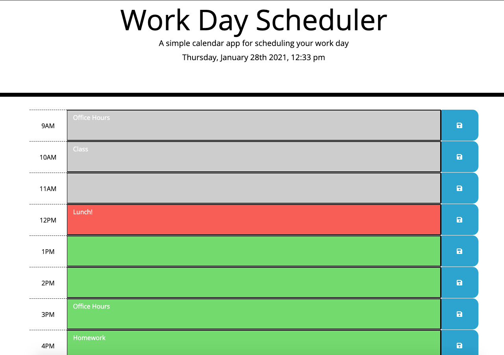

# Work Day Planner

We created a page so that a user may plan their work day. The features of this page include several individual time blocks, per hours of the standard work day (9 a.m. - 5 p.m.), that users may enter information into. Depending on the time of day, each time block will display a color: gray if the hour corresponding to the time block has past, red if it is currently the hour, and green if it has yet to come.

Leveraging local storage, it was also a goal of this application to allow users to save their inputs in each respective time block. In the event that a user needs to reload the page, or accidentally closes out of it, they need not worry. Their input in the text area of their time blocks will be saved, even upon the page reloading.

- JavaScript
- HTML
- CSS

Link to the application: **[jimbopulos.github.io/day-planner](https://jimbopulos.github.io/day-planner/)**
