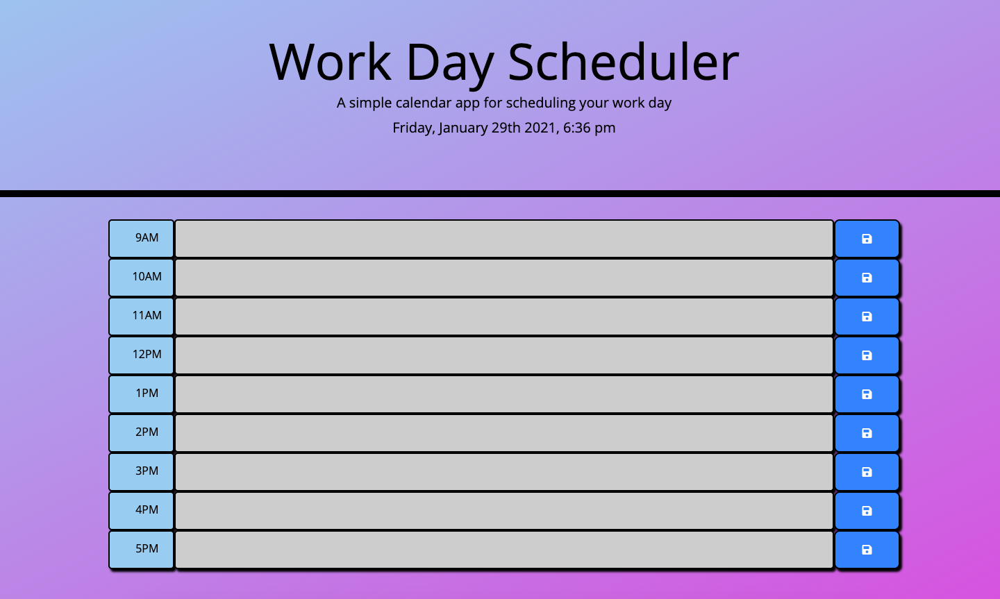
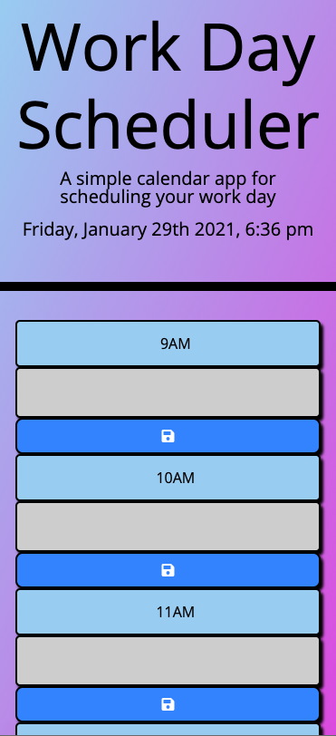

# Work Day Planner

## Description

An application to add tasks for a user's given work day. 

The features of this page include several individual time blocks, per hours of the standard work day (9 a.m. - 5 p.m.). Depending on the time of day, each time block will display a color: gray if the hour corresponding to the time block has past, red if it is currently the hour, and green if it has yet to come.

## Table of Contents

- [Usage](#usage)
- [Technologies](#technologies)
- [License](#license)

## Usage

Users may enter information into individual timeblocks, and save their tasks via the buttons located to the right of each block.

Desktop view:

Mobile view:

Link to the application: **[jimbopulos.github.io/day-planner](https://jimbopulos.github.io/day-planner/)**

## Technologies
- JavaScript
- HTML
- CSS

## Questions

If you have any questions, please contact jimbopulos at james.mgalantino@gmail.com

## License

This application is covered under the MIT license.

Copyright (c) 2021 James Galantino

Permission is hereby granted, free of charge, to any person obtaining a copy
of this software and associated documentation files (the "Software"), to deal
in the Software without restriction, including without limitation the rights
to use, copy, modify, merge, publish, distribute, sublicense, and/or sell
copies of the Software, and to permit persons to whom the Software is
furnished to do so, subject to the following conditions:

The above copyright notice and this permission notice shall be included in all
copies or substantial portions of the Software.

THE SOFTWARE IS PROVIDED "AS IS", WITHOUT WARRANTY OF ANY KIND, EXPRESS OR
IMPLIED, INCLUDING BUT NOT LIMITED TO THE WARRANTIES OF MERCHANTABILITY,
FITNESS FOR A PARTICULAR PURPOSE AND NONINFRINGEMENT. IN NO EVENT SHALL THE
AUTHORS OR COPYRIGHT HOLDERS BE LIABLE FOR ANY CLAIM, DAMAGES OR OTHER
LIABILITY, WHETHER IN AN ACTION OF CONTRACT, TORT OR OTHERWISE, ARISING FROM,
OUT OF OR IN CONNECTION WITH THE SOFTWARE OR THE USE OR OTHER DEALINGS IN THE
SOFTWARE.